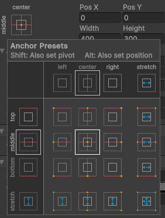

# Workshop UI (04/04/2025)

> Max Janssen, Giannini Pruijn, Haroon Muhammad, Nusayba El Mourabet en Kyan Kersten.

Het doel van deze workshop is om de basis van Unity UI te leren. 
We gaan een game maken waarin de speler items op kan pakken, kan ruilen met een villager en items op kan slaan in een kast. De logica van deze game is al gemaakt, maar de UI ontbreekt nog.

## 1. Project Openen 
Ga naar de [demo repo](https://github.com/MaxJanssen2002/UI_Research_Prototypes/tree/main/Vendor_Game) op GitHub en clone de ``workshop`` branch. Open vervolgens het project in Unity. 
De scene die geopend wordt is de ``ShopScene``.

Je kunt als de speler rondlopen in de scene. Het is echter vrij lastig om te zien waar je muis zit en weten we niet hoeveel emeralds de speler heeft.

## Stap 1: Speler UI 

### 1.1 Crosshair
1. Begin met het aanmaken van een nieuw canvas. ``(GameObject -> UI -> Canvas)``. Dit is de basis van je UI, hier kunnen we nieuwe elementen aan toevoegen.
2. Een voorbeeld van zo'n element is een ``Raw Image``. Voeg deze toe aan het canvas.
3. In de Inspector, zet de positie op ``Pos X en Pos Y op 0``. Dit zorgt ervoor dat de crosshair in het midden van het scherm staat. Zet de ``Width en Height`` wat lager (bijvoorbeeld naar 50).
4. Klik op de cirkel naast 'Texture' en selecteer de afbeelding ```"Crosshair"```. 


### 1.2 Emerald saldo
1. Voeg een ``Raw Image`` en ``Text`` toe aan het canvas. Let op, deze tekst moet TextMeshPro zijn. Hierbij wordt er gevraagd of je TMP Essentials wilt importeren, klik op ``Import TMP Essentials``.
2. Verander de texture van de afbeelding naar ```"Emerald"```.
3. Selecteer het canvas in de Hierarchy en druk op de F toets. 
4. Verplaats de afbeelding naar de linkerbovenhoek van het canvas. 
5. Verplaats de tekst naar rechts van de afbeelding. 
6. Onder Rect transform in de Inspector zie je de Anchor Presets. Zet deze naar ```Top``` en ```Left```. **Doe dit voor beide elementen**. 
Dit zorgt ervoor dat de elementen op de juiste plek blijven staan, ongeacht de grootte van het scherm.


7. Kijk ook even naar in ``Scripts/Trader Scripts/PlayerScript``. Daar zijn drie belangrijke coderegels om de UI 'op de hoogte' te houden van je emeraldsaldo via een script.

- ``using TMPro;`` (regel 3, dit is de library die ondersteuning geeft voor het TMP_Text-datatype.)
- ``[SerializeField] private TMP_Text emeraldCountText;`` (regel 11, dit zal de instantie van jouw tekst in de UI zijn.)
- ``emeraldCountText.text = emeraldCount.ToString();`` (regel 72, hiermee wordt de tekst in de UI up to date gehouden.)

8. Ga terug naar de Editor en sleep de door jou gemaakte tekst naar de ``Emerald Count Text`` variabele van het ``Player Script``, deze staat onder de Invisible_Player in de Hierarchy. Er staan nog allerlei variabelen die nog moeten ingevuld, maar die komen later.


9. Het canvas schaalt nog niet mee met de grootte van het scherm. Dit kan je aanpassen door in de inspector de ```Canvis Scaler -> UI Scale Mode``` naar ```Scale with Screen Size``` te zetten.

### Resultaat

## Stap 2: Items tonen in een Inventory

Als je op E klikt terwijl je aan het spelen bent, moet er een inventory op je scherm verschijnen.

### 2.1 Maak een rechthoek als subscherm

1. Maak een canvas (``(GameObject -> UI -> Canvas)``). Noem dit een InventoryCanvas.
2. Zet (in de Inspector) de UI Scale Mode op ``Scale with Screen Size``.
3. Zet de Reference Resolution op ``X: 1920`` en ``Y: 1080``.
3. Zorg dat de InventoryCanvas een child is van de InvisiblePlayer in de Hierarchy.
4. Maak een Image (``(GameObject -> UI -> Image)``) en noem het InventoryMenu. Zet het als child van de InventoryCanvas, mocht dit nog niet zo zijn.
5. Stel (in de Inspector) de Rect Transform van de InventoryMenu in zoals in de afbeelding hieronder (let op dat er 'stretch' staat aan de linkerkant):


6. Zorg dat de InventoryMenu ``Background`` als Source Image heeft in de Inspector. Let ook op dat je InventoryMenu een child is van je InventoryCanvas. De Color mag je zelf bepalen.


### 2.2 Maak een grid voor je items

1. Voeg een component toe aan de InventoryMenu, genaamd een ``Grid Layout Group``.
2. Stel de ``Grid Layout Group`` als volgt in (``Cell Size``, ``Shading`` en ``Child Alignment`` moeten worden aangepast):


### 2.3 Voorzie de player van de UI

1. Voeg twee componenten toe aan de Inspector van de Invisible_Player:
    - Een script genaamd ``Player Inventory`` (dit script bestaat al).
        - ``Player Inventory`` leest de informatie uit het ScriptableObject in ``Assets/InventoryData`` uit en instantieert straks de items in de Grid Layout Group die je hebt toegevoegd.
    - Een script genaamd ``Inventory Manager`` (bestaat ook al).
        - ``Inventory Manager`` zorgt ervoor dat de UI van de inventory zichtbaar wordt als je op E drukt en weer onzichtbaar wordt als je E loslaat. Ook wordt de crosshair onzichtbaar gemaakt als de inventory zichtbaar is.
2. De Player Script, de Player Inventory en de Inventory Manager hebben wel wat informatie nodig om te werken. Voeg de volgende informatie toe:
    - Aan de Player Script:
        - Sleep je InventoryMenu in ``Inventory Slots``.
        - Sleep je InventoryMenu in ``Inventory Menu``.
        - Sleep de PlayerInventory script in ``Player Inventory``.
    - Aan de Player Inventory:
        - Sleep het ScriptableObject in ``Assets/InventoryData`` naar ``Inventory Data``.
        - Sleep je InventoryMenu in ``Inventory Slots``.
        - Sleep de prefab genaamd ItemSlot in ``Assets/Prefabs/Inventory Prefabs`` naar ``Item Slot Prefab``. Verander de Color in de Image-component van deze prefab als je de kleur blauw niet mooi vindt.
    - Aan de Inventory Manager:
        - Sleep je InventoryMenu in ``Inventory Menu``.
        - Sleep je Crosshair uit Stap 1 naar ``Cross Hair``.

Als het goed is ziet de Inspector van Invisible_Player er nu zo uit (``Trade UI`` en ``Select Item Prompt`` worden later ingevuld):


3. Start het spel en houd E ingedrukt. Als het goed is zie je het volgende:


Als je de inhoud van het ScriptableObject ``Assets/InventoryData`` buiten runtime verandert, kun je objecten weghalen en toevoegen. Je kunt een Master_Ball, een Book en een Among_Us_Figure toevoegen.

## Stap 3: Items ruilen met een Villager 

Als je op x klikt twerijl je naar een villager kijkt wil je dat er een scherm opent om Items te kopen.

1. Maak een canvas (``(Rechter muisknop -> UI -> Canvas)``). Noem dit VillagerTradeCanvas.
2. Voeg hier een Panel aan toe (``(Rechter muisknop -> UI -> Panel)``). Noem Dit TradePanel. Zorg dat TradePanel een child van VillgagerTradeCanvas.
3. Selecteer TradePanel, pas in de inspector het volgende aan:
 a. Zet de Anchor Preset op Middle & Center 
 b. Zet de Width & Height op 400&300.
 c. Pas onder Image de Color aan naar de gewenste kleur.
4. Voeg aan de TradePanel 2 Button's en 2 Text Velden toe, (``(Rechter muisknop -> UI -> Button - TextMeshPro)``), (``(Rechter muisknop -> UI -> Text - TextMeshPro)``), zorg ervoor dat deze objecten child van TradePanel zijn.
5. Noem de Tekstvelden ItemName & ItemPrice.
6. Noem de Button BuyButton & CloseButton.
8. De net gemaakte buttons bevatten een child, Text(TMP), pas hiervan de tekst aan door in de inspector in het tekstveld de gewenste tekst in te vullen.


Als het goed is heb je nu een scherm voor je met 2 buttons en 2 tekstvelden wat er ongeveer zo uit ziet, als dit het geval is ben je klaar voor de volgende stap
We Gaan nu de scripts linken aan de buttons en tekstvelden.

9. Voeg Het TradeUI Script Toe aan VillagerTradeCanvas.
10. Voeg je gemaakte buttons en tekstvelden toe aan het script in de inspector.

Als je nu naar een villager kijkt en ok 'X' klikt opent het trading menu, waar je in kan traden met de villager.

## Stap 4: Items opslaan in een kast
In de winkel is een lege kast te zien. Deze heeft 12 slots waarin de speler items kan opslaan. Op het moment is het niet zichtbaar hoeveel items er in de kast zitten en welke prijs deze items hebben. 

### 4.1 Item aantal boven de kast 
1. Maak een nieuw canvas, zorg ervoor dat de Render Mode op ```World Space``` staat. Dit zorgt ervoor dat het canvas in de wereld staat en niet in het scherm, dit maakt de UI 3D. Zet de Pos X op 0, Pos y op 2, width op 2 en height op 1.
2. Voeg een Text toe aan het canvas en hernoem deze naar `ItemStorage`. Zet ook hier de Pos X en Pos Y op 0, Width op 2 en Height op 1. Zet de Font Size op 0.5 en de Alignment op ```Center``` en ```Middle```. Verander de tekst naar ``0``. 
3. Herhaal stap 1 met een Raw Image en hernoem deze naar `ItemFrame`. Selecteer bij de texture ``Item_Frame_29_JE3``. De aanbevolen Width en Height van de image is ``0.5``. Zorg er zelf voor dat deze image naast de tekst staat.
4. Voeg aan het canvas het script ```Look at Cam``` toe. Sleep de main camera naar de ```Fps Cam```. Hierdoor blijft het canvas altijd naar de camera kijken. 

5. Voeg het canvas toe als child voor de ```Closet``` prefab.
6. Selecteer de closet prefab in de Hierarchy. Voeg nu de ``ItemStorage`` tekst toe aan de `CountText` van het `Closet` script.

### Resultaat 


### 4.2 Item prijs boven de items
1. Herhaal stap 1.1 van 4.1 met een nieuwe canvas. 
2. Zorg er nu voor dat er een Raw Image (Emerald) en een Text aan het canvas zitten. Zorg er zelf voor dat de tekst en de image goed staan.
3. Voeg aan het canvas het script ```Look at Cam``` toe. Sleep de main camera naar de ```Fps Cam```.
4. Voeg het canvas toe als child voor de ```Masterball, Among us Figure en Book``` prefabs.
5. Pas de ``Rect Transform`` van het canvas voor iedere prefab aan. Het kan zijn dat je de Y positie een beetje aan moet passen om het canvas goed te laten staan.


### Resultaat
