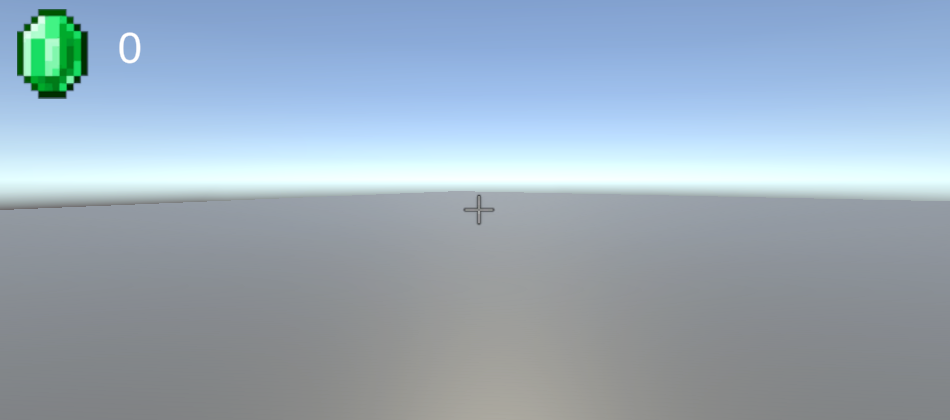

# Workshop UI (02/04/2025)

> Max Janssen, Giannini Pruijn, Haroon Muhammad, Nusayba El Mourabet en Kyan Kersten.

Het doel van deze workshop is om de basis van Unity UI te leren. 
We gaan een game maken waarin de speler items op kan pakken, kan ruilen met een villager en items op kan slaan in een kast. De logica van deze game is al gemaakt, maar de UI ontbreekt nog.

## 1. Project Openen 
Ga naar de [demo repo](https://github.com/MaxJanssen2002/UI_Research_Prototypes/tree/main/Vendor_Game) op GitHub en clone de ``workshop`` branch. Open vervolgens het project in Unity. 
De scene die geopend wordt is de Main scene, deze is op het moment nog leeg. 

1. Sleep de world prefab in de scene. 
2. Sleep de player prefab in de scene.

De scene is nu een stuk minder leeg en de speler kan rondlopen. Het is echter vrij lastig om te zien waar je muis zit en weten we niet hoeveel emeralds de speler heeft. 

## Stap 1: Speler UI 

### 1.1 Crosshair
1. Begin met het aanmaken van een nieuw canvas. ``(GameObject -> UI -> Canvas)``. Dit is de basis van je UI, hier kunnen we nieuwe elementen aan toevoegen.
2. Een voorbeeld van zo'n element is een ``Raw Image``. Voeg deze toe aan het canvas.
3. In de Inspector, zet de positie op ``Pos X en Pos Y op 0``. Dit zorgt ervoor dat de crosshair in het midden van het scherm staat. Zet de ``Width en Height`` wat lager (bijvoorbeeld naar 50).
4. Klik op de cirkel naast 'Texture' en selecteer de afbeelding ```"Crosshair"```. 


### 1.2 Emerald saldo
1. Voeg een ``Raw Image`` en ``Text`` toe aan het canvas. Let op, deze tekst moet TextMeshPro zijn. Hierbij wordt er gevraagd of je TMP Essentials wilt importeren, klik op ``Import TMP Essentials``.
2. Verander de texture van de afbeelding naar ```"Emerald"```.
3. Selecteer het canvas in de Hierarchy en druk op de F toets. 
4. Verplaats de afbeelding naar de linkerbovenhoek van het canvas. 
5. Verplaats de tekst naar rechts van de afbeelding. 
6. Onder Rect transform in de Inspector zie je de Anchor Presets. Zet deze naar ```Top``` en ```Left```. **Doe dit voor beide elementen**. 
Dit zorgt ervoor dat de elementen op de juiste plek blijven staan, ongeacht de grootte van het scherm.

    
7. Ga terug naar de Editor en sleep de door jou gemaakte tekst naar de ``Emerald Count Text`` variabele van het ``Player Script``, deze staat onder de player in de Hierarchy. 


Het canvas schaalt nog niet mee met de grootte van het scherm. Dit kan je aanpassen door in de inspector de ```Canvis Scaler -> UI Scale Mode``` naar ```Scale with Screen Size``` te zetten.

### Resultaat

## Stap 2: Items toevoegen aan een Inventory

Als je op E klikt terwijl je aan het spelen bent, moet er een inventory op je scherm verschijnen.

### 2.1 Maak een rechthoek als subscherm

1. Maak een canvas (``(GameObject -> UI -> Canvas)``). Noem dit een InventoryCanvas.
2. Zet de UI Scale Mode op ``Scale with Screen Size``.
3. Zorg dat de InventoryCanvas een child is van de InvisiblePlayer in de Hierarchy.
4. Maak een Image (``(GameObject -> UI -> Image)``) en noem het InventoryMenu. 
5. Stel (in de Inspector) de Rect Transform van de InventoryMenu in zoals in de afbeelding hieronder (let op er 'stretch' staat aan de linkerkant):


6. Zorg dat de InventoryMenu ``Background`` als Source Image heeft in de Inspector. Let ook op dat je InventoryMenu een child is van je InventoryCanvas. De Color mag je zelf bepalen.


### 2.2 Maak een grid voor je items

5. Voeg een component toe aan de InventoryMenu, genaamd een ``Grid Layout Group``.
6. Stel de ``Grid Layout Group`` als volgt in:


## Stap 3: Items ruilen met een Villager 
## Stap 4: Items opslaan in een kast
In de winkel is een lege kast te zien. Deze heeft 12 slots waarin de speler items kan opslaan. Op het moment is het niet zichtbaar hoeveel items er in de kast zitten en welke prijs deze items hebben. 

### 4.1 Item aantal boven de kast 
1. Maak een nieuw canvas, zorg ervoor dat de Render Mode op ```World Space``` staat. Dit zorgt ervoor dat het canvas in de wereld staat en niet in het scherm, dit maakt de UI 3D. Zet de Pos X op 0, Pos y op 2, width op 2 en height op 1.
2. Voeg een Text toe aan het canvas en hernoem deze naar `ItemStorage`. Zet ook hier de Pos X en Pos Y op 0, Width op 2 en Height op 1. Zet de Font Size op 0.5 en de Alignment op ```Center``` en ```Middle```. Verander de tekst naar ``0``. 
3. Herhaal stap 1 met een Raw Image en hernoem deze naar `ItemFrame`. Selecteer bij de texture ``Item_Frame_29_JE3``. De aanbevolen Width en Height van de image is ``0.5``. Zorg er zelf voor dat deze image naast de tekst staat.
4. Voeg aan het canvas het script ```Look at Cam``` toe. Sleep de main camera naar de ```Fps Cam```. Hierdoor blijft het canvas altijd naar de camera kijken. 

5. Voeg het canvas toe als child voor de ```Closet``` prefab.
6. Selecteer de closet prefab in de Hierarchy. Voeg nu de ``ItemStorage`` tekst toe aan de `CountText` van het `Closet` script.

### Resultaat 


### 4.2 Item prijs boven de items
1. Herhaal stap 1.1 van 4.1 met een nieuwe canvas. 
2. Zorg er nu voor dat er een Raw Image (Emerald) en een Text aan het canvas zitten. Zorg er zelf voor dat de tekst en de image goed staan.
3. Voeg aan het canvas het script ```Look at Cam``` toe. Sleep de main camera naar de ```Fps Cam```.
4. Voeg het canvas toe als child voor de ```Masterball, Among us Figure en Book``` prefabs.
5. Pas de ``Rect Transform`` van het canvas voor iedere prefab aan. Het kan zijn dat je de Y positie een beetje aan moet passen om het canvas goed te laten staan.


### Resultaat
